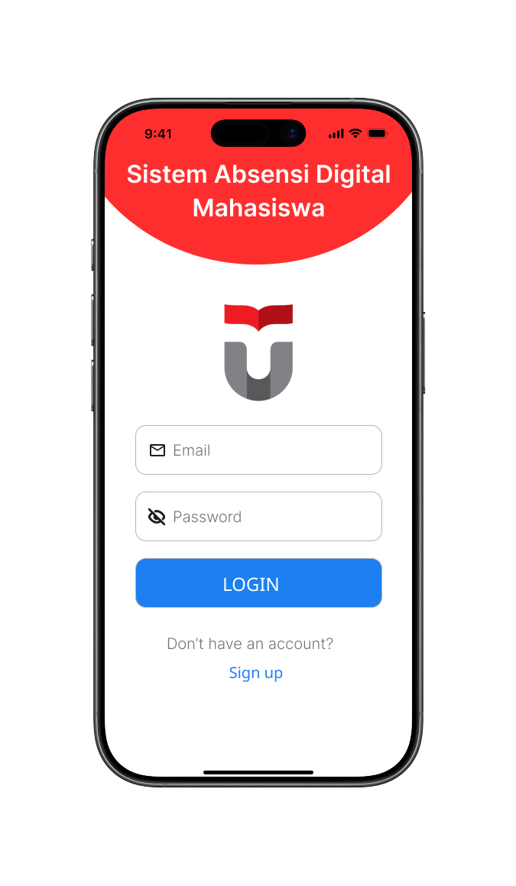
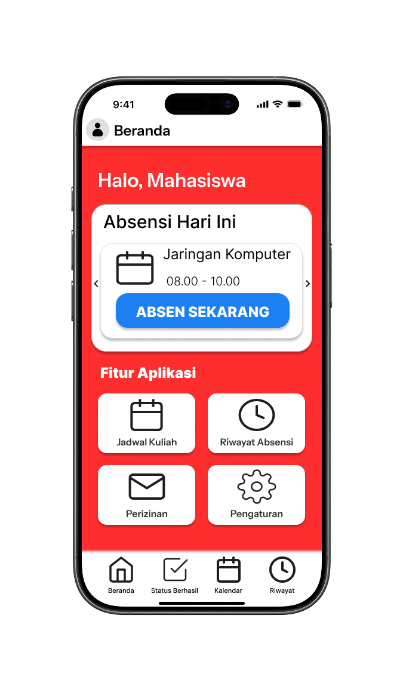
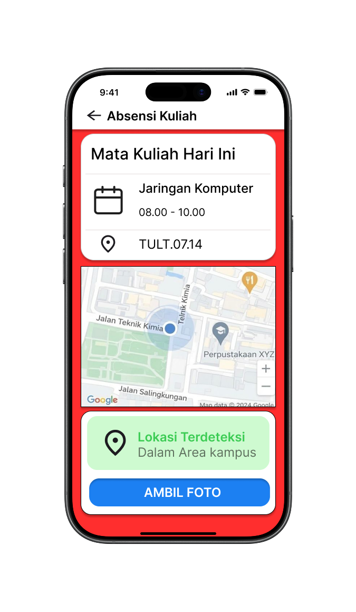

# 🚀 Tugas Besar: Sistem Absensi Digital

> **Dosen Pengampu:** Muhammad Shiddiq Azis, S.T., MBA

---

## 📊 Perancangan Sistem (DFD)

### DFD Level 0

### DFD Level 1

---

## 🎨 Mockup Antarmuka
Rancangan UI aplikasi yang berfokus pada pengalaman pengguna.

| Login Page | Beranda | Absensi Kuliah |
| :---: | :---: | :---: |
|  |  |  |

---

## 🛠️ Stack Teknologi
- **Frontend:** HTML, CSS, JavaScript (Vue.js)
- **Backend:** Golang, Gin
- **Database:** MySQL

---

## 📂 Cara Instalasi
1. `git clone https://github.com/Raniahhasna98o6/Sistem-Absensi-Digital`
2. `npm install`
3. `npm run dev`
