# 🚀 Tugas Besar: Sistem Absensi Digital

> **Dosen Pengampu:** Muhammad Shiddiq Azis, S.T., MBA  
> **Oleh:** Kelompok 2  
> **Ketua:** Sean Benedict Umahag (103012400087)  
> **Anggota Kelompok:**  
> 1. Ni Komang Cantik Marsali (103012400319)  
> 2. Raniah Hasna Fadiyah (103012430009)

---

## 📊 Perancangan Sistem

### DFD Level 0
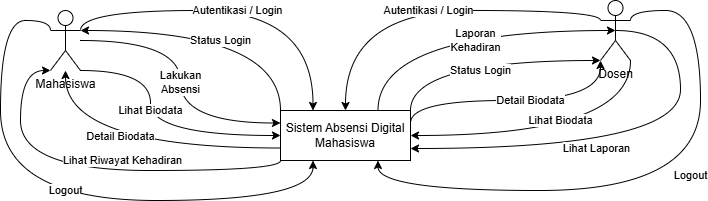

### DFD Level 1
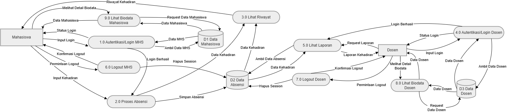

### ERD
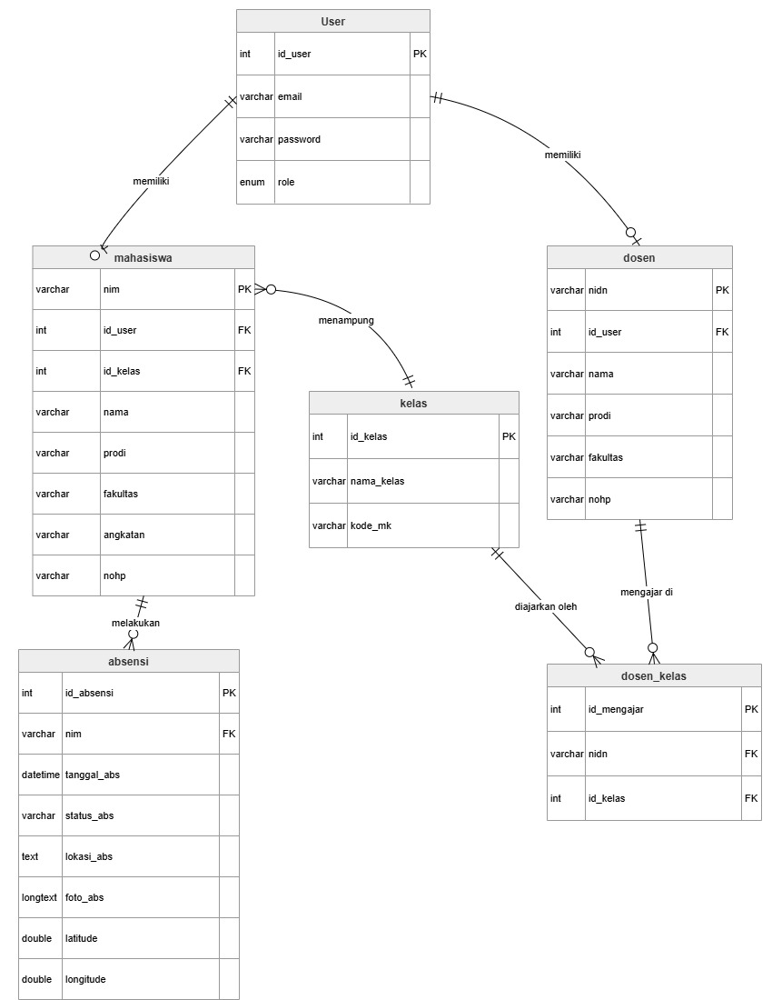

### CLASS DIAGRAM
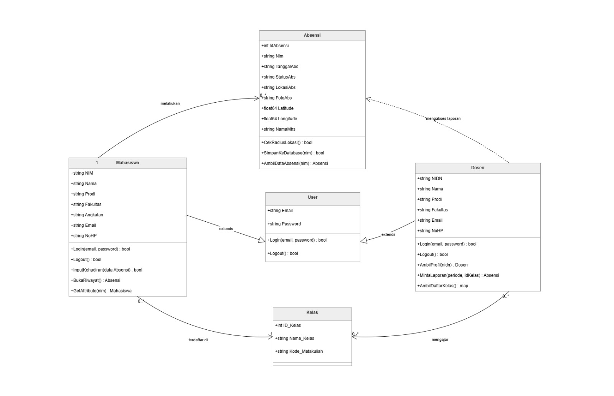

---

## 🎨 Mockup Antarmuka
Rancangan UI aplikasi yang berfokus pada pengalaman pengguna.

| Login Page 1 | Login Page 2 | Beranda |
| :---: | :---: | :---: |
| 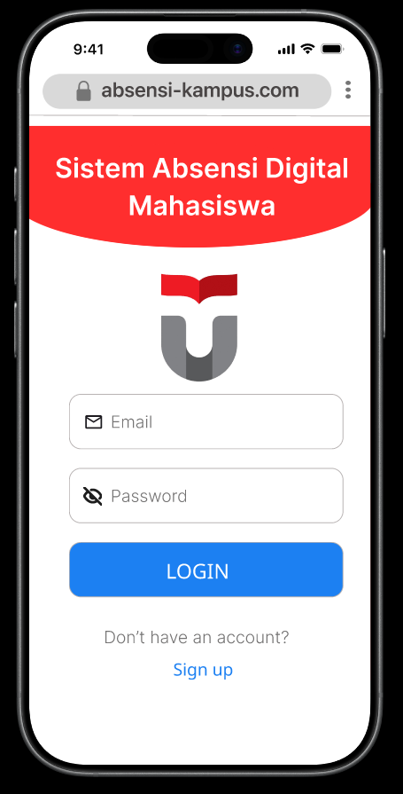 | 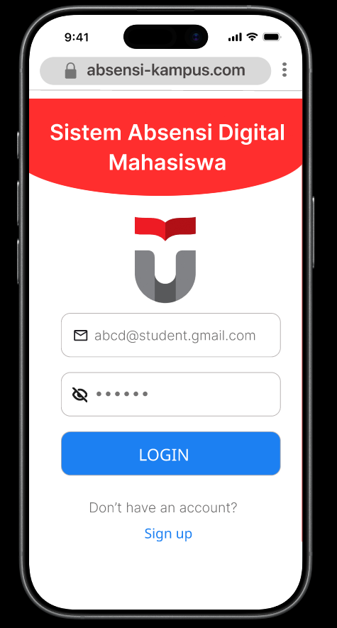 | 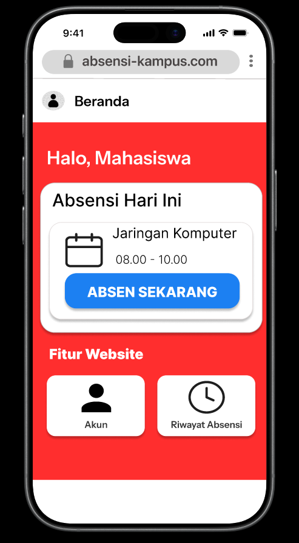 |

| Absensi Kuliah | Ambil Foto Absensi | Verifikasi Foto | Verifikasi Berhasil |
| :---: | :---: | :---: | :---: |
| 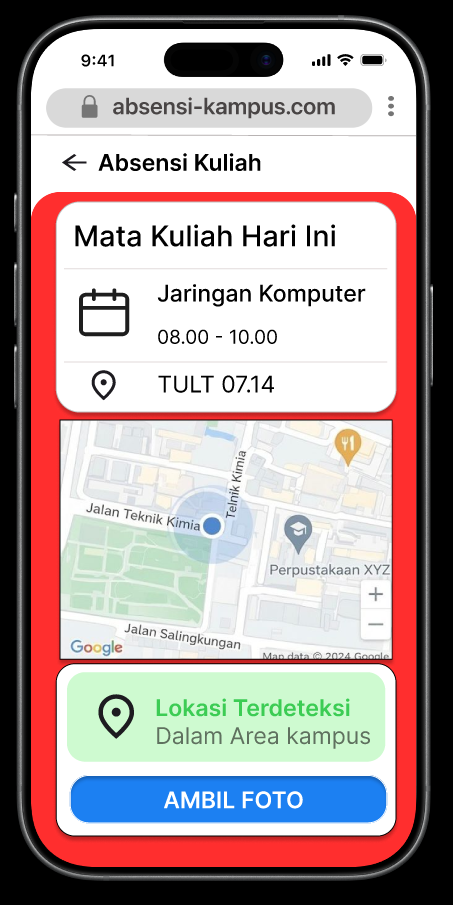 | 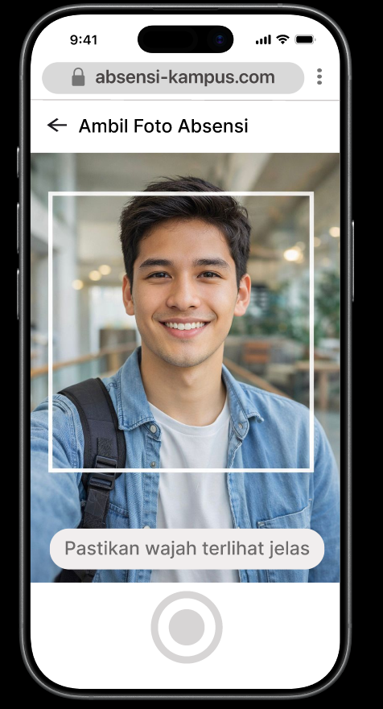 | 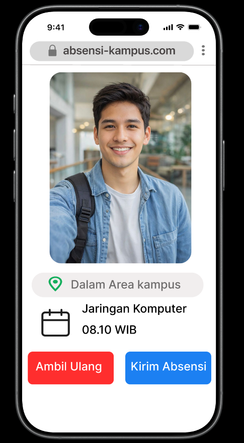 | 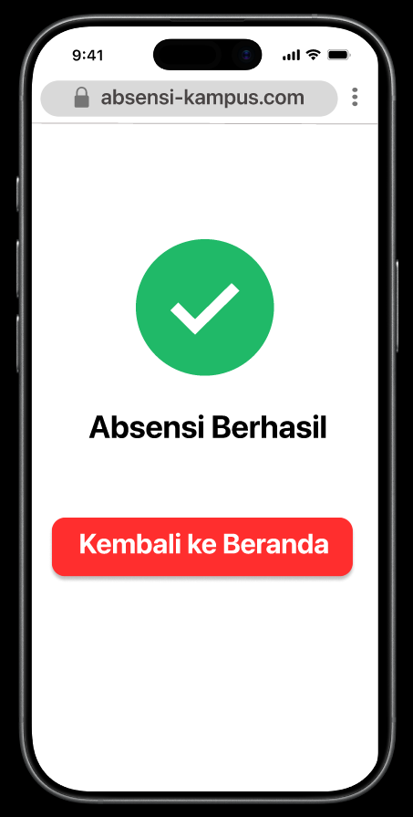 |

| Akun Saya | Riwayat Absensi - Semua | Riwayat Absensi - Hadir | Riwayat Absensi - Tidak Hadir |
| :---: | :---: | :---: | :---: |
| 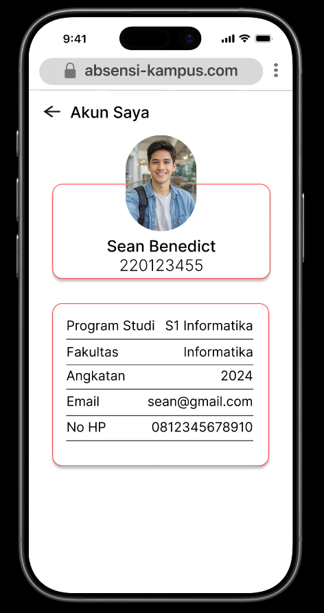 | 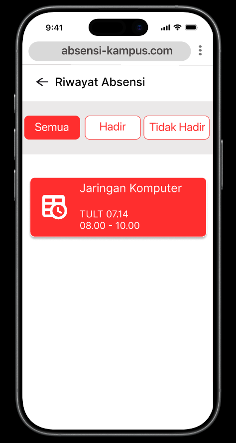 | 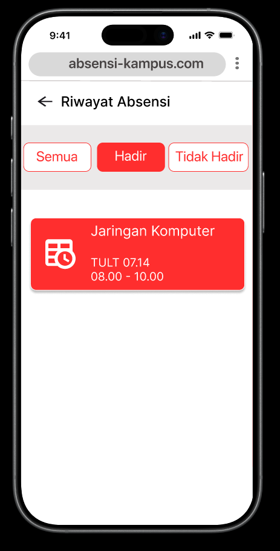 | 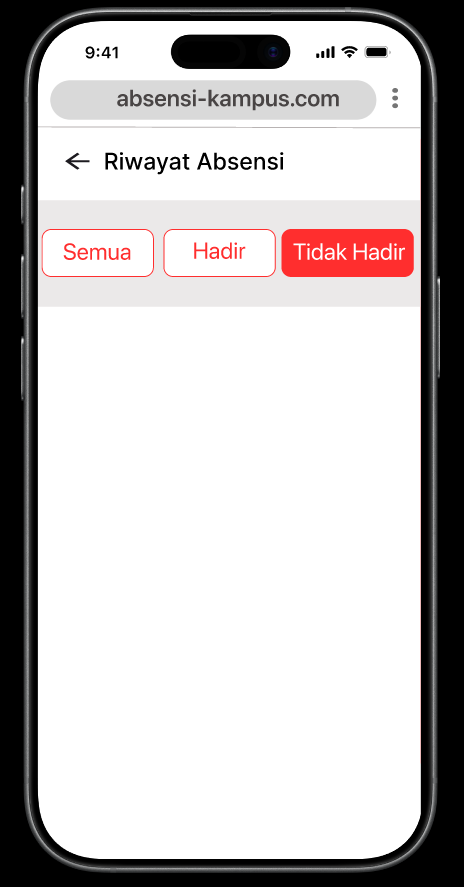 |

---

## 🛠️ Stack Teknologi
- **Frontend:** HTML, CSS, JavaScript (Vue.js)
- **Backend:** Golang, Gin
- **Database:** MySQL

---

## 📂 Cara Instalasi
1. `git clone https://github.com/Raniahhasna98o6/Sistem-Absensi-Digital`
2. `npm install`
3. `npm run dev`
