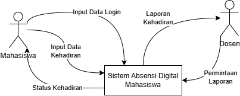
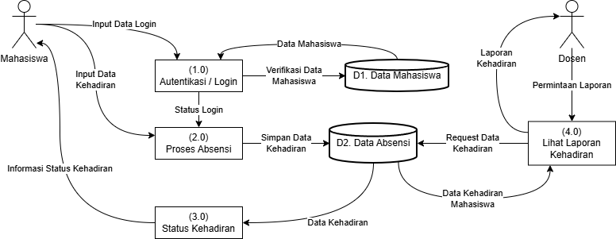
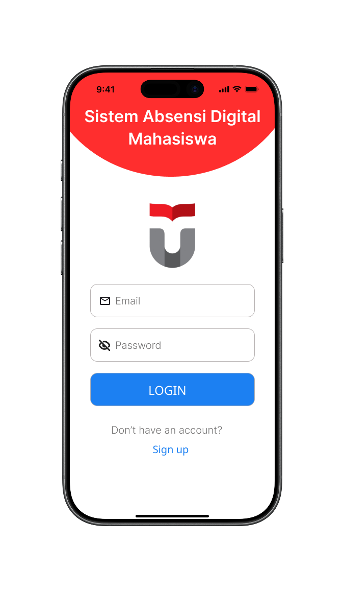
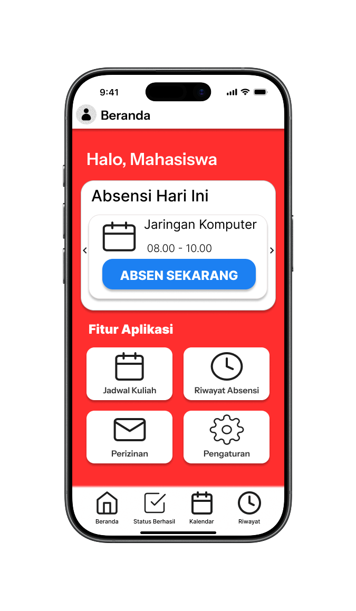
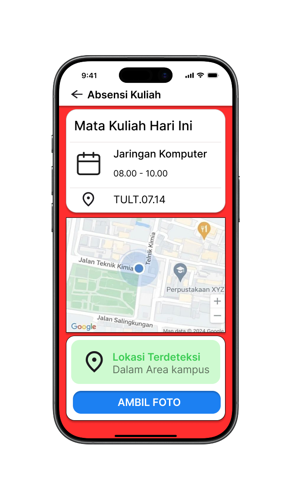

# 🚀 Tugas Besar: Sistem Absensi Digital

> **Dosen Pengampu:** Muhammad Shiddiq Azis, S.T., MBA

---

## 📊 Perancangan Sistem (DFD)

### DFD Level 0

### DFD Level 1

---

## 🎨 Mockup Antarmuka
Rancangan UI aplikasi yang berfokus pada pengalaman pengguna.

| Login Page | Beranda | Absensi Kuliah |
| :---: | :---: | :---: |
|  |  |  |

---

## 🛠️ Stack Teknologi
- **Frontend:** HTML, CSS, JavaScript (Vue.js)
- **Backend:** Golang, Gin
- **Database:** MySQL

---

QUERY MY SQL:

CREATE DATABASE IMPAL;
USE IMPAL;
CREATE TABLE User(
	id_user VARCHAR(20) PRIMARY KEY,
    nama VARCHAR(100),
    email VARCHAR(100),
    password VARCHAR(255)
);

CREATE TABLE Mahasiswa(
	id_user VARCHAR(20) PRIMARY KEY,
    NIM VARCHAR (15) UNIQUE,
    FOREIGN KEY (id_user) REFERENCES User(id_user)
);

CREATE TABLE Dosen(
	id_user VARCHAR(20) PRIMARY KEY,
    NIDN VARCHAR (15) UNIQUE,
    FOREIGN KEY (id_user) REFERENCES User(id_user)
);

CREATE TABLE KRS(
    id_user VARCHAR(20),
    kode_mk VARCHAR(10),
    semester INT NOT NULL,
    PRIMARY KEY (id_user, kode_mk),
    FOREIGN KEY (id_user) REFERENCES Mahasiswa(id_user),
    FOREIGN KEY (kode_mk) REFERENCES Mata_Kuliah(kode_mk)
);

CREATE TABLE Nilai(
    id_user VARCHAR(20),
    kode_mk VARCHAR(10),
    nilai_angka DOUBLE,
    nilai_index VARCHAR(2),
    PRIMARY KEY (id_user, kode_mk),
    FOREIGN KEY (id_user, kode_mk) REFERENCES KRS(id_user, kode_mk)
);

CREATE TABLE Ruangan(
    id_ruangan INT AUTO_INCREMENT PRIMARY KEY,
    nama_ruangan VARCHAR(50),
    kapasitas INT
);

CREATE TABLE Mata_Kuliah(
    kode_mk VARCHAR(10) PRIMARY KEY,
    id_user VARCHAR(20) NOT NULL,
    id_ruangan INT,
    nama_mk VARCHAR(100),
    jadwal VARCHAR(100),
    FOREIGN KEY (id_user) REFERENCES Dosen(id_user),
    FOREIGN KEY (id_ruangan) REFERENCES Ruangan(id_ruangan)
);

CREATE TABLE Absensi(
    id_absensi INT AUTO_INCREMENT PRIMARY KEY,
    id_user VARCHAR(20),
    kode_mk VARCHAR(10),
    tanggal_abs DATE,
    status_abs ENUM("Hadir", "Izin", "Sakit", "Alpha"),
    lokasi_abs VARCHAR(100),
    FOREIGN KEY (id_user) REFERENCES Mahasiswa(id_user),
    FOREIGN KEY (kode_mk) REFERENCES Mata_Kuliah(kode_mk)
);

CREATE TABLE Laporan(
	id_laporan INT auto_increment PRIMARY KEY,
    id_user VARCHAR(20),
    periode VARCHAR(20),
	FOREIGN KEY (id_user) REFERENCES User(id_user)
);

SELECT * FROM User;
SELECT * FROM Mahasiswa;
SELECT * FROM Dosen;
SELECT * FROM KRS;
SELECT * FROM Nilai;
SELECT * FROM Ruangan;
SELECT * FROM Mata_Kuliah;
SELECT * FROM Absensi;
SELECT * FROM Laporan;
---

| Login Page 1 | Login Page 2 | Absensi |
| :---: | :---: | :---: |
|  |  |  |

| Akun | Ambil Foto | Beranda |
| :---: | :---: | :---: |
|  |  |  |

| Hadir | Semua | Tidak Hadir |
| :---: | :---: | :---: |
|  |  |  |

| Verifikasi Foto | Verifikasi Berhasil |
| :---: | :---: |
|  |  |

---

## 📂 Cara Instalasi
1. `git clone https://github.com/Raniahhasna98o6/Sistem-Absensi-Digital`
2. `npm install`
3. `npm run dev`
